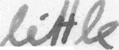

# SimpleHTR
HandWritten Text Recognition using ML (TensorFlow)
## Run demo

Go to the `model/` directory and unzip the file `model.zip` (pre-trained on the IAM dataset).
Take care that the unzipped files are placed directly into the `model/` directory and not some subdirectory created by the unzip-program.
Afterwards, go to the `src/` directory and run `python main.py`.
The input image and the expected output is shown below.



```
> python main.py
Validation character error rate of saved model: 10.624916%
Init with stored values from ../model/snapshot-38
Recognized: "little"
Probability: 0.96625507
```

Tested with:

* Python 2 and Python 3
* TF 1.3, 1.10 and 1.12

Ide Used:
Pycharm by JetBrains
Spyder By Anaconda Corp
Python version used:
Python 3.3
Also tested in Python 2.X


A project By Vishnu Vandith Guntupalli
Vidya Jyothi Institute Of Technology

******************************************** END *************************************************************
